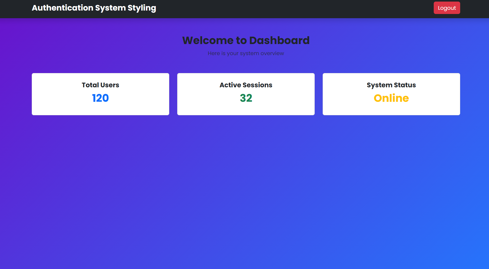

# Authentication System (Bootstrap Styled)

## Project Overview
This project is a simple **Authentication System** built using **HTML, Bootstrap 5, and Custom CSS**.  
It demonstrates a basic authentication flow including login, registration, password reset, and a dashboard page.

The purpose of this project is to convert a plain HTML authentication system into a **professional and responsive web application using Bootstrap**.

---

## Features

- Responsive design using **Bootstrap 5**
- Clean UI with **Bootstrap Cards and Forms**
- Custom styling using **CSS**
- Login page with email and password
- Registration page with password strength indicator
- Password visibility toggle
- Forgot password functionality
- Reset password page
- Simple dashboard layout
- Mobile-friendly interface

---

## Pages Included

### 1. Login Page (`index.html`)
Allows users to enter their email and password to log in.

### 2. Registration Page (`register.html`)
Allows new users to create an account with name, email, and password.

### 3. Forgot Password Page (`forgot-password.html`)
Allows users to request a password reset link.

### 4. Reset Password Page (`reset-password.html`)
Allows users to create a new password.

### 5. Dashboard Page (`dashboard.html`)
Displays a simple dashboard layout with navigation and information cards.

---

## Technologies Used

- **HTML5**
- **Bootstrap 5**
- **CSS3**
- **Bootstrap Icons**
- **Google Fonts**

---
## Project Structure

```
html-authentication-poc/

│
├── index.html              # Login page
├── register.html           # Registration page
├── forgot-password.html    # Forgot password page
├── reset-password.html     # Reset password page
├── dashboard.html          # Dashboard page
├── styles.css               # Custom CSS styling
├── README.md               # Project documentation
│
├── login.png
├── register.png
├── forgot-password.png
├── reset-password.png
└── dashboard.png
```


## Screenshots

### Login Page


### Register Page


### Forgot Password Page


### Reset Password Page


### Dashboard Page


## How to Run the Project

1. Clone or download the repository.
2. Open the project folder.
3. Open `index.html` in any web browser.

## Author

Ganashree B S  
Fullstack Java Development Student

